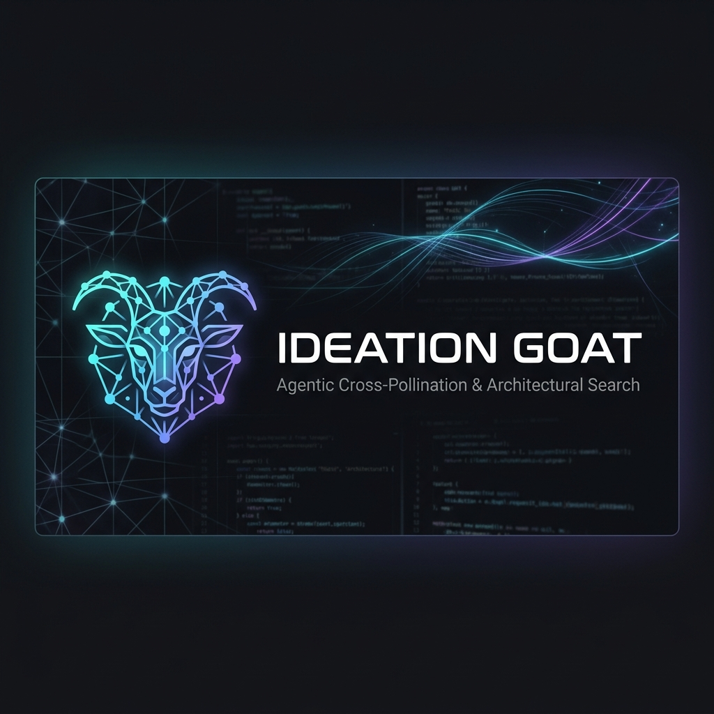
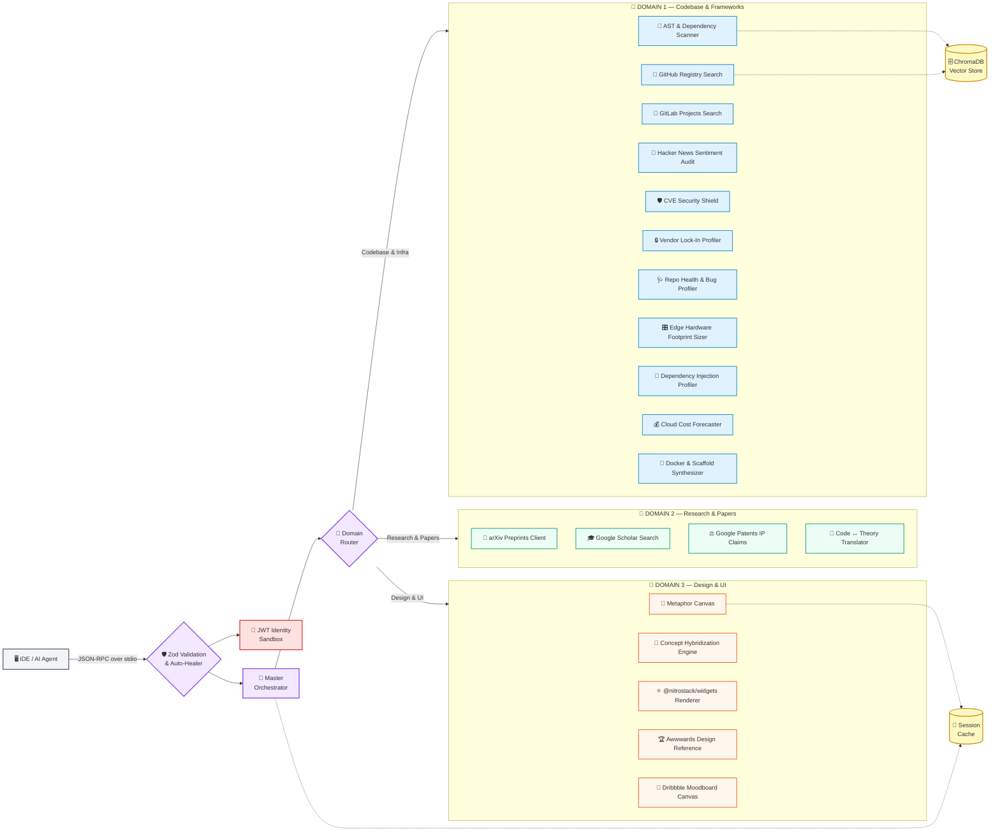

<div align="center">
  <h1>Ideation GOAT</h1>
  <p><strong>Cross-Domain Cross-Pollination & Ideation Engine for AI Agents</strong></p>
  
  <p>
    
    
    
  </p>
</div>


---

The Multi-Domain Semantic Architect Agent is an enterprise-grade Model Context Protocol server that operates as the analytical and creative subconscious of advanced AI coding agents. It exposes **24 autonomous diagnostic tools** spanning three distinct knowledge domains — codebases, academic research, and visual design — enabling AI agents to validate technical compatibility, audit supply-chain security, hybridize cross-domain concepts, and scaffold production-ready project architectures in a single unified pipeline.

Powered by **Gemini 3.1 Flash Lite** for high-speed structural reasoning, enforced by **Zod-based auto-healing middleware** that self-corrects malformed LLM parameters at runtime, and deployed via the **NitroStack** framework for serverless MCP hosting on NitroCloud.

---

## 🏗️ System Architecture



---

## ⚡ Capability Matrix

### 🛠️ 24 Autonomous Tools

| # | Tool | Domain | Purpose |
|:--|:-----|:-------|:--------|
| 1 | `search_knowledge_grid` | D1 & D2 | Multi-domain semantic search with Target and Discovery modes |
| 2 | `breed_concepts` | D3 | Cross-pollinate two paradigms into a hybrid architectural blueprint |
| 3 | `bridge_code_and_theory` | D2 | Bidirectional code ↔ LaTeX mathematical translation |
| 4 | `assess_viability` | D2 | Patent collision detection and defensive evasion strategy |
| 5 | `search_academic_papers` | D2 | Parallel arXiv + Google Scholar literature sweep |
| 6 | `write_scaffolding_files` | D1 | Automated project skeleton and boilerplate generator |
| 7 | `verify_workspace_fit` | D1 | License and ecosystem compatibility auditor |
| 8 | `compose_solution_stack` | D1 | Multi-layer architectural decomposition and framework matching |
| 9 | `get_repo_health` | D1 | Real-time GitHub health, stars, and CVE telemetry |
| 10 | `profile_repo_hardware_footprint` | D1 | Edge device SRAM/Flash memory footprint estimation |
| 11 | `align_system_architecture` | D1 | Directory structure pattern detection and alignment scoring |
| 12 | `analyze_workspace_ast` | D1 | Zero-friction offline AST and dependency tree parser |
| 13 | `check_repo_health` | D1 | Supply-chain risk and maintenance health auditor |
| 14 | `check_ecosystem_lockin` | D1 | Vendor lock-in dependency scanner and portability grader |
| 15 | `analyze_repo_bugs` | D1 | TF-IDF semantic clustering of chronic bug patterns |
| 16 | `orchestrate_architectural_workflow` | D1 & D2 | Unified multi-step diagnostic pipeline orchestrator |
| 17 | `forecast_live_costs` | D1 | Cloud hosting cost estimator (AWS, Vercel, Supabase, Neon) |
| 18 | `auto_heal_parameters` | Core | Zod-based autonomous parameter type coercion and typo correction |
| 19 | `verify_identity_token` | Core | JWT authentication sandbox with scope verification |
| 20 | `profile_dependency_injection` | D1 | DI pattern quality scanner and modularity scorer |
| 21 | `generate_docker_scaffolding` | D1 | Multi-stage Dockerfile and docker-compose generator |
| 22 | `scan_local_cves` | D1 | OSV.dev vulnerability scanner with severity-based execution gates |
| 23 | `search_gitlab_repos` | D1 | GitLab project registry search integration |
| 24 | `audit_hacker_news_trends` | D1 | Real-time developer sentiment and mention trend auditor |

### 🧠 Core Intelligence Features

| Feature | Technology | Description |
|:--------|:-----------|:------------|
| 🤖 **LLM Synthesis Engine** | Gemini 3.1 Flash Lite | Powers concept hybridization, semantic analysis, and cross-domain analogy generation |
| 🛡️ **Zod Auto-Healing** | `@nitrostack/core` | Intercepts malformed LLM parameters at runtime, coerces types, corrects typos, applies defaults |
| 🔐 **Identity Sandbox** | PyJWT + OAuth 2.1 | Validates JWT tokens, enforces permission scopes, and gates privileged file operations |
| 🌌 **Metaphor Canvas** | MCP Resource | Exposes interactive node-and-edge cognitive graphs for frontend visualization |
| 📊 **Offline-First Testing** | Python unittest | 32/32 tests pass completely offline in under 2 seconds via mocked API interfaces |

---

## 📦 Installation & Setup

### 1. Clone the Repository

```bash
git clone https://github.com/suzaykid/ideation-goat.git
cd ideation-goat
```

### 2. Install Python Core Dependencies

```bash
python3 -m venv .venv
source .venv/bin/activate
pip install --upgrade pip
pip install -r requirements.txt
```

### 3. Install TypeScript Wrapper Dependencies

```bash
pnpm install
```

### 4. Configure Environment Variables

```bash
cp .env.example .env
```

Open `.env` and populate the required keys:

| Variable | Purpose |
|:---------|:--------|
| `GEMINI_API_KEY` | Gemini 3.1 Flash Lite API key for LLM synthesis |
| `GITHUB_TOKEN` | GitHub Personal Access Token (optional, bypasses rate limits) |
| `GITLAB_API_TOKEN` | GitLab API token for project registry searches |
| `CHROMA_DB_PATH` | Local path to ChromaDB vector store collection |

---

### 4. Install Dependencies
```bash
pip install --upgrade pip
pip install -r requirements.txt
```

---

## 🚀 Running the Server

### Standalone stdio Mode
You can run the server directly in your terminal to verify that it starts correctly:
```bash
python server.py
```

### Integration with Claude Desktop
To integrate Ideation GOAT, edit your `claude_desktop_config.json` configuration file:

*   **macOS:** `~/Library/Application Support/Claude/claude_desktop_config.json`
*   **Windows:** `%APPDATA%\Claude\claude_desktop_config.json`

Replace `/ABSOLUTE/PATH/TO/ideation-goat` with the actual absolute path to your repository.

#### Configuration (macOS / Linux)
```json
{
  "mcpServers": {
    "ideation-goat": {
      "command": "/ABSOLUTE/PATH/TO/ideation-goat/.venv/bin/python",
      "args": [
        "/ABSOLUTE/PATH/TO/ideation-goat/server.py"
      ]
    }
  }
}
```

#### Configuration (Windows)
```json
{
  "mcpServers": {
    "ideation-goat": {
      "command": "C:\\ABSOLUTE\\PATH\\TO\\ideation-goat\\.venv\\Scripts\\python.exe",
      "args": [
        "C:\\ABSOLUTE\\PATH\\TO\\ideation-goat\\server.py"
      ]
    }
  }
}
```
---

## 🧪 Running the Offline Test Suite

Ideation GOAT includes a comprehensive unit testing suite that uses mocks to run completely offline without requiring internet access or API credentials.

Run the test suite using standard Python:
```bash
.venv/bin/python -m unittest discover -s tests
```

---

## 🎨 Interactive Resources

### Constellation Map Graph (`ideation-goat://canvas`)
The server exposes a custom MCP resource mapping cognitive paths. It returns a node-and-edge JSON graph containing:
*   **Nodes:** Matched codebase topics, patents, and academic papers.
*   **Edges:** Cognitive distances and relational overlaps.
*   **Use Case:** Frontends can fetch this URI to render interactive, node-based visual graphics showing where ideas intersect.

---

## 📄 License & Restrictions

This project is licensed under the GPL-3.0 License.

### Automated Training & Ingestion Restriction
*   **NO AI Training Ingestion:** Ingestion of code, text, layouts, designs, or assets for training, validation, testing, or tuning of machine learning models or neural networks is strictly prohibited.
*   **NO Automated Scraping:** Scraping, harvesting, or automated crawling of this repository by spiders or scraper bots is prohibited.
*   **Personal/Human Use Only:** Access is provided strictly for human code inspection and educational review.

