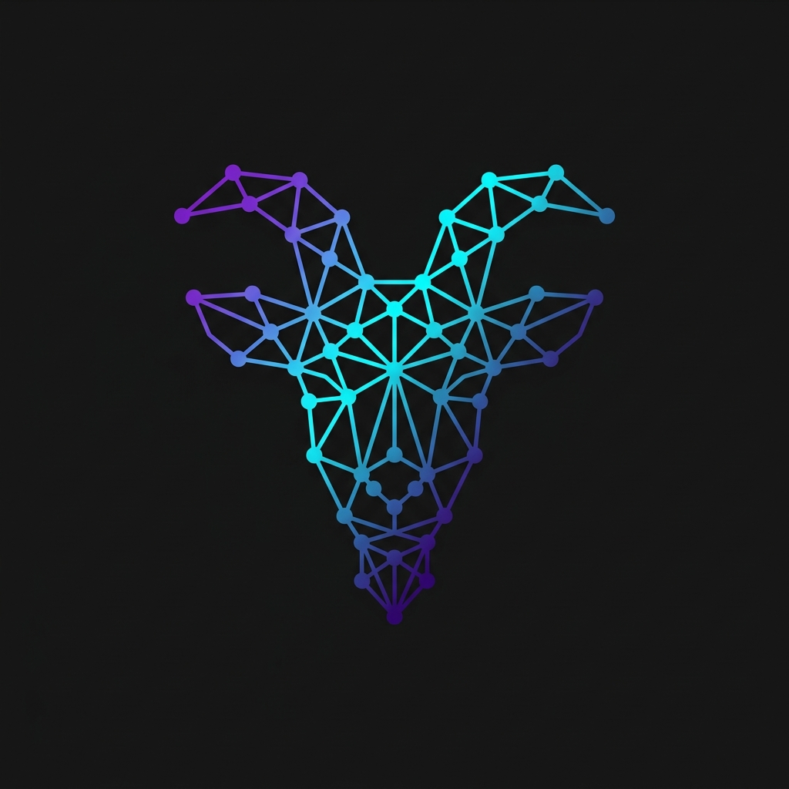

<div align="center">
  
  <h1>Ideation GOAT</h1>
  <p><strong>Cross-Domain Cross-Pollination & Ideation Engine for AI Agents</strong></p>
  
  <p>
    
    
    
  </p>
</div>

---

## What It Is

Ideation GOAT is an MCP (Model Context Protocol) server that acts as the creative subconscious of advanced AI agents. It performs cross-domain knowledge hybridization, patent viability analysis, and architecture synthesis — outputting structured JSON payloads and Mermaid.js diagrams that coding agents can immediately consume.

No UI. No web frontend. Just a pure engine designed to be called by Claude Desktop, Cursor, Windsurf, or custom agent swarms.

## Core Tools

| Tool | Purpose |
|---|---|
| **`search_knowledge_grid`** | Multi-domain query engine across GitHub repos, arXiv papers, Google Scholar, and patent databases. Supports **target mode** (direct precision) and **discovery mode** (inverse-similarity cross-pollination). |
| **`breed_concepts`** | Takes two distinct concept vectors, computes their relational intersection, and returns a structured JSON payload detailing how the mechanics of System A can be grafted onto System B. |
| **`assess_viability`** | Cross-references a design against patent claims and market competitors. Returns semantic vector gaps — safe design directions free of active conflicts. |
| **`generate_scaffolding_doc`** | Compiles a concept synthesis into a rigorous Systems Architecture Specification with Mermaid.js diagrams and mathematical constraints, ready for downstream coding agents. |

## Architecture

```
AI Agent (Claude Desktop / Cursor / Custom Swarm)
    |
    | JSON-RPC over stdio
    |
    v
server.py (FastMCP)
    |
    +-- search_knowledge_grid (query, mode, cognitive_distance)
    +-- breed_concepts (concept_a, concept_b)
    +-- assess_viability (system_design)
    +-- generate_scaffolding_doc (synthesis_output)
```

## Discovery Mode (Inverse-Similarity)

The dual-engine framework supports two query modes:

- **Target Mode**: Finds direct operational equivalents within the same domain space.
- **Discovery Mode**: Bypasses native domain clusters. Filters out exact-domain matches and selects highest-scoring records from foreign domain groups (Biology, Mechanical Engineering, etc.) that share underlying functional structure.

The `cognitive_distance` parameter (0.0–1.0) controls how far into foreign domain clusters the search reaches.

## Installation

```bash
git clone https://github.com/suzaykid/ideation-goat.git
cd ideation-goat
pip install -r requirements.txt
```

## Running

### Standalone (stdio)

```bash
python server.py
```

### Claude Desktop Configuration

Add to your `claude_desktop_config.json`:

**macOS:** `~/Library/Application Support/Claude/claude_desktop_config.json`
**Windows:** `%APPDATA%\Claude\claude_desktop_config.json`

```json
{
  "mcpServers": {
    "ideation-goat": {
      "command": "uv",
      "args": [
        "--directory",
        "/ABSOLUTE/PATH/TO/ideation-goat",
        "run",
        "server.py"
      ]
    }
  }
}
```

### Cursor / Windsurf Configuration

Add the same configuration to your MCP settings file in the respective IDE.

## Example Usage

Once configured, trigger the engine through your AI client:

> *"I want to design a new distributed caching database. Call `search_knowledge_grid` using `discovery` mode with a cognitive distance of 0.85 to find alternative operational models outside computer science. Then, take the best biological match and breed it with standard Redis architecture definitions."*

## Tech Stack

| Layer | Technology |
|---|---|
| **MCP Protocol** | [FastMCP](https://github.com/modelcontextprotocol/python-sdk) (stdio transport) |
| **Type Safety** | Pydantic v2 |
| **Language** | Python 3.9+ |

## Project Structure

```
ideation-goat/
├── server.py              # MCP server (main entry point)
├── data_ingestion.py      # Utility: GitHub API data pipeline
├── requirements.txt       # Python dependencies
├── README.md
└── Archives/
    ├── mcp_server_v1.py   # Archived: original MCP server
    ├── roadmap.md         # Original 5-phase roadmap
    └── Future_Steps.md    # Tracked pending work items
```

## Roadmap

- [x] MCP Server with dual-engine search
- [x] Concept breeding (cross-pollination)
- [x] Patent viability assessment
- [x] Architecture specification generator
- [x] Cloud vector DB integration (Pinecone / Supabase pgvector)
- [x] Live arXiv and Google/Semantic Scholar ingestion
- [x] Patent database API connections
- [x] LLM synthesis for "Why this fits you"

## License

This project is licensed under the GPL-3.0 License - see the [LICENSE](LICENSE) file for details.

---

## Licensing & Privacy Protection

This repository contains personal code and intellectual property. **Strict privacy protections are in place.**

### Prohibitions on AI Training & Scraping

This repository is published for direct human viewing only. Automated data scraping, harvesting, and crawling are strictly prohibited under the author's personal copyright terms.

**By accessing this repository or its contents, you agree to the following terms:**
*   **NO AI/LLM Ingestion:** Any ingestion of code, text, layouts, designs, or assets for training, validation, testing, or tuning of machine learning models, neural networks, or artificial intelligence systems is strictly prohibited.
*   **NO Automated Data Scraping:** Any automated extraction, parsing, harvesting, or scraping of content by bots, crawlers, scripts, or spiders is prohibited.
*   **Personal Use Only:** Human viewing for personal or educational review is permitted. No duplication, modification, adaptation, or commercial distribution of this work is allowed without express written permission.
